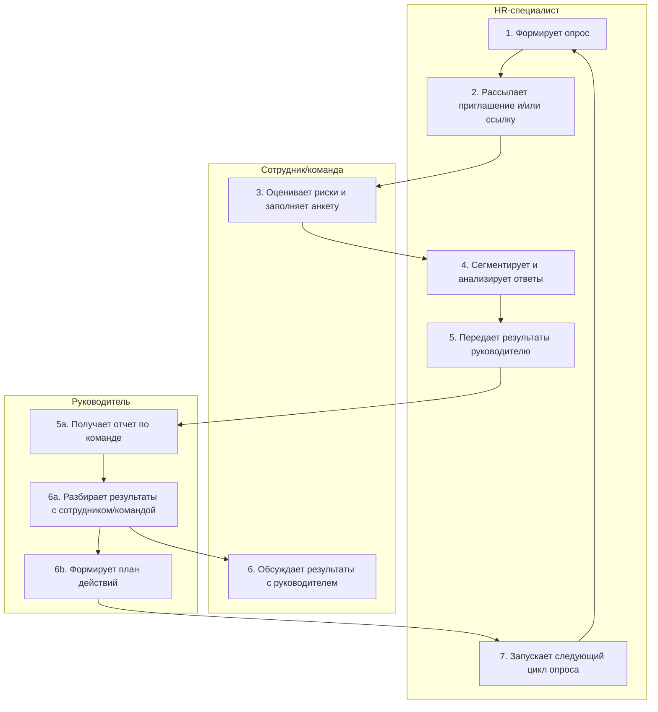

# Анализ процесса AS-IS

## Границы процесса

| Граница | Событие |
|---|---|
| Начало | HR инициирует очередной цикл сбора обратной связи (годовой опрос / pulse-опрос / exit-интервью) |
| Конец | Результаты обработаны, план действий сформирован (или не сформирован), цикл завершен и запускается следующий |
| Вне процесса | Процессы найма, онбординга, Performance Review |

## Диаграмма процесса


## Шаги процесса

| # | Шаг | Роль | Вход | Выход | Система | Время | Частота | Ожидание |
|---|---|---|---|---|---|---|---|---|
| 1 | Формирование опроса: формулировка вопросов, определение разрезов (отдел, грейд, стаж), обещание анонимности | HR-специалист | Бизнес-запрос на обратную связь | Анкета с вопросами и метаданными | Google Forms/Яндекс формы/внутренняя платформа | 1–2 недели | Ежеквартально/Раз в полгода/раз в год | Да |
| 2 | Рассылка приглашения и/или ссылки на опрос | HR-специалист | Готовая анкета | Приглашение сотрудникам | Email/корпоративный портал/мессенджер | 1 день | Ежеквартально/Раз в полгода/раз в год | Да |
| 3 | Оценка рисков и заполнение анкеты | Сотрудник/команда | Приглашение и/или ссылка | Ответы (оценки + free-text) | Google Forms/Яндекс формы/внутренняя платформа | 15–30 минут | Ежеквартально/Раз в полгода/раз в год | Нет |
| 4 | Сегментация и анализ ответов | HR-специалист | Сырые данные | Отчет с разрезами по командам, ролям, стажу | Excel/BI-система | 1–2 недели | Ежеквартально/Раз в полгода/раз в год | Да |
| 5 | Передача результатов руководителю | HR-специалист | Отчет | Презентация/дашборд для руководителя | Презентация/дашборд | 1 час | Ежеквартально/Раз в полгода/раз в год | Да |
| 6 | Разбор результатов с командой | Руководитель | Отчет | Обсуждение, выявление проблем | Онлайн/оффлайн встреча | 1-2 часа | Ежеквартально/Раз в полгода/раз в год | Нет |
| 7 | Формирование плана действий | Руководитель + HR | Результаты обсуждения | План действий с ответственными и сроками | Документ/трекер задач | 1–2 недели | Ежеквартально/Раз в полгода/раз в год | Нет |

## Источники данных

| Что утверждаем | Источник | Тип | Как получен |
|---|---|---|---|
| Доля сотрудников, верящих в анонимность, менее 30% | https://cdn.sogolytics.com/blog/wp-content/uploads/2024/09/Employee_Engagement_SogoStudy.pdf#1#1 | Документ | Анализ отчета |
| Доля социально желательных ответов в exit-интервью — более 50% | https://www.intoo.com/wp-content/uploads/sites/2/2024/04/INTOO_FWOW_2024.pdf#2#2 | Документ | Анализ отчета |
| Доля конкретных free-text комментариев — менее 15% | https://www.cultureamp.com/blog/employee-survey-comments?utm_source=www.strictlyinternal.com&utm_medium=referral&utm_campaign=strictly-internal-issue-19 | Документ | Анализ отчета |
| Повторяемость одних и тех же проблем — более 60% | https://cits.wa.gov.au/docs/default-source/local-government/inquiries/city-of-perth/copi_volume-4_redacted.pdf?sfvrsn=56d195e7_3#100#94 | Документ | Анализ отчета |
| Время от сигнала до видимого изменения — более 6 месяцев | https://happily.ai/blog/engagement-data-timing-problem/?ref=happily.ai/blog	 | Документ | Анализ отчета |

## Обнаруженные проблемы

| # | Проблема | Тип | Влияние | Источник |
|---|---|---|---|---|
| 1 | HR стремится получить больше деталей, а сотрудник оценивает риск узнаваемости | Точка отказа | Формально полные, но содержательно бедные данные | Шаг 1 процесса AS-IS |
| 2 | Сотрудник не понимает, какие метаданные собираются, кто видит ответы и как защищены малые группы | Невидимое знание | Игнорирование опроса, задержка ответа, смещение выборки | Шаг 2 процесса AS-IS |
| 3 | Сотруднику необходимо одновременно сообщить правду и сохранить безопасность | Потеря мотивации | Средние оценки, пропуск комментариев, безличные фразы, согласование ответов с коллегами | Шаг 3 процесса AS-IS |
| 4 | Опрос обещает анонимность, но собирает отдел, грейд и стаж; малые группы деанонимизируются | Точка отказа | Сотрудники не верят в анонимность, выбирают безопасные ответы | Шаг 2 процесса AS-IS |
| 5 | В exit-интервью сотруднику нужна рекомендация, поэтому правда невыгодна | Потеря мотивации | Социально желательные ответы, сокрытие реальных причин ухода |  |

Обходные пути, которые используют сотрудники:
- Выбор нейтральных формулировок и отказ от чувствительных тем
- Игнорирование опроса или задержка ответа
- Обсуждение «можно ли доверять ссылке» с коллегами
- Средние оценки и пропуск комментариев
- Согласование ответов с коллегами
- Перенос чувствительных тем в личные чаты
- Формальное заполнение «для галочки»

## Оценка потерь

```text
Потери времени HR на обработку невалидных данных:
= (время проектирования + время анализа) × частота
= (2 недели + 2 недели) × 4 раза в год
= 16 недель в год (4 месяца)

Потери времени сотрудников на заполнение опросов, которые не приводят к изменениям:
= время заполнения × количество сотрудников × частота
= 20 минут × 500 сотрудников × 4 раза в год
= 40 000 минут = 667 часов в год
```

## Связь с этапом 1

| Проблема AS-IS | Противоречие из 01_problem.md |
|---|---|
| HR стремится получить больше деталей, сотрудник оценивает риск узнаваемости | Нам необходимо повысить достоверность и регулярность обратной связи, НО чем детальнее HR собирает и хранит ответы, тем выше воспринимаемая возможность идентификации |
| Сотрудник не понимает, какие метаданные собираются | Чем больше HR пытается получить конкретику и привязать её к человеку/команде, тем сильнее страх |
| Максимум напряжения при заполнении анкеты | Сотрудники чаще скрывают проблемы, выбирают безопасные ответы или не участвуют |
| Чем точнее разрез, тем легче косвенная идентификация | Автоматизация без смены процесса может усилить контроль и окончательно убить честность |

**Почему противоречие не решается приказом:**
Приказ «говорить честно» не меняет ожидаемую цену высказывания и не доказывает, что сообщение приведёт к действию. Видимые действия после обратной связи критичны для доверия к следующему циклу, поэтому сбор без замыкания контура воспроизводит исходную проблему.

**Системные риски сохранения AS-IS:**
- Позднее обнаружение перегрузки и конфликтов
- Ошибочные управленческие решения на искажённых данных
- Рост цинизма к HR-инструментам
- Выгорание сотрудников
- Скрытый отток талантов
